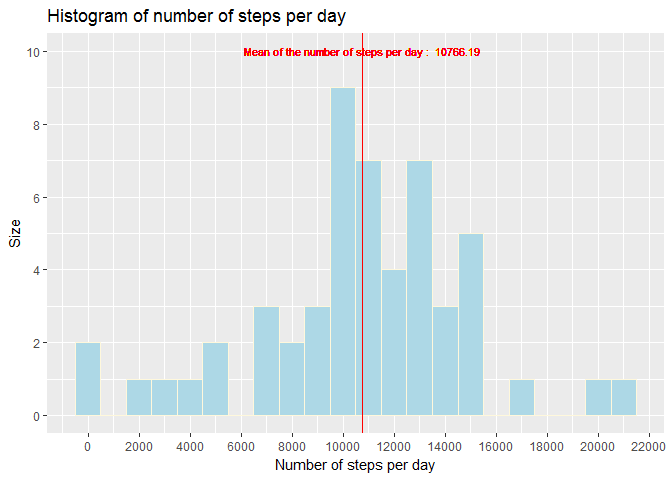
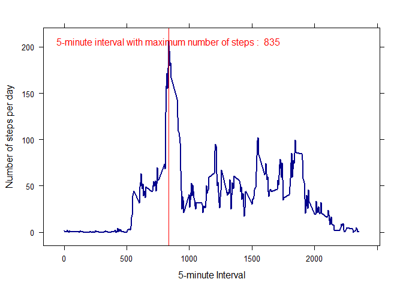
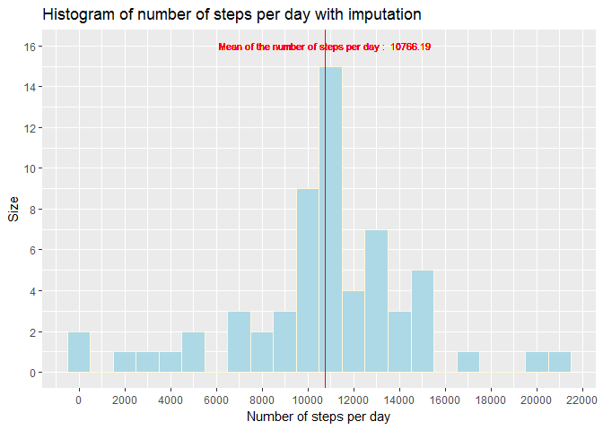
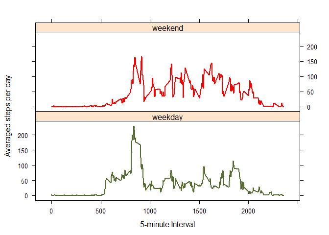

# Reproducible research -Week 2 Assignment 1
Olivier Cazin  
June 16, 2017  

# 1. Introduction

This assignment makes use of data from a personal activity monitoring device. This device collects data at 5 minute intervals throughout the day. The data consists of 2 months of data from an anonymous individual collected during the months of October and November, 2012 and include the number of steps taken in 5 minute intervals each day.

This document results from the fisrt Assignment Reproducible Research Coursera Course. It is written in a single R markdown document that can be processed by knitr and transformed into an HTML file.


## 1.1. Global options setting

In order to make the code readable, we always use the instruction : echo = TRUE when writing code chunks in the R Markdown document.


```r
library(knitr)
knitr::opts_chunk$set(echo = TRUE)
```

## 1.2. Packages loading

We use particularly 4 packages : dplyr, ggplot,lattice and lubridate


```r
library(dplyr)
library(ggplot2)
```

```
## Warning: package 'ggplot2' was built under R version 3.3.3
```

```r
library(lattice)
library(lubridate)
```

# 2. Data loading and preprocessing 

## 2.1. Data loading

At first, activity.csv file has been downloaded and saved in our working directory. Then, we simply read the data with read.csv() function.


```r
activity <- read.csv("activity.csv", header = TRUE, sep = ',', colClasses = c("numeric", "character","integer"))
```

## 2.2. Data tidying

We convert date from caracter to date format with ymd() function of lubridate package and then we take a first insight with str(), head() and tail() function.  


```r
activity$date <- ymd(activity$date)
str(activity)
```

```
## 'data.frame':	17568 obs. of  3 variables:
##  $ steps   : num  NA NA NA NA NA NA NA NA NA NA ...
##  $ date    : Date, format: "2012-10-01" "2012-10-01" ...
##  $ interval: int  0 5 10 15 20 25 30 35 40 45 ...
```

```r
head(activity)
```

```
##   steps       date interval
## 1    NA 2012-10-01        0
## 2    NA 2012-10-01        5
## 3    NA 2012-10-01       10
## 4    NA 2012-10-01       15
## 5    NA 2012-10-01       20
## 6    NA 2012-10-01       25
```

```r
tail(activity)
```

```
##       steps       date interval
## 17563    NA 2012-11-30     2330
## 17564    NA 2012-11-30     2335
## 17565    NA 2012-11-30     2340
## 17566    NA 2012-11-30     2345
## 17567    NA 2012-11-30     2350
## 17568    NA 2012-11-30     2355
```

# 3. What is mean total number of steps taken per day?

For this part of the assignment the missing values can be ignored.  
our objective is to :  
- calculate the total number of steps taken per day  
- calculate and report the mean and median of the total number of steps taken per day  
- make a histogram of the total number of steps taken each day  

3.1. We determine the total number of steps per day by using dplyr package :


```r
number_steps <- activity %>%
  dplyr::filter(!is.na(steps)) %>%
  dplyr::group_by(date) %>%
  dplyr::summarize(steps = sum(steps)) %>%
  print
```

```
## # A tibble: 53 × 2
##          date steps
##        <date> <dbl>
## 1  2012-10-02   126
## 2  2012-10-03 11352
## 3  2012-10-04 12116
## 4  2012-10-05 13294
## 5  2012-10-06 15420
## 6  2012-10-07 11015
## 7  2012-10-09 12811
## 8  2012-10-10  9900
## 9  2012-10-11 10304
## 10 2012-10-12 17382
## # ... with 43 more rows
```

3.2. We compute the mean and median of the total number of steps taken per day :


```r
mean_steps <- mean(number_steps$steps, na.rm = TRUE)
median_steps <- median(number_steps$steps, na.rm = TRUE)
cat( "The Mean of number of steps per day is : ",mean_steps," and the median : ",median_steps)
```

```
## The Mean of number of steps per day is :  10766.19  and the median :  10765
```

3.3. We use ggplot for making the histogram :


```r
ggplot(number_steps, aes(x = steps)) + geom_histogram(fill = "lightblue", colour="cornsilk",binwidth = 1000)  + scale_y_continuous(breaks=seq(0,10,2)) + scale_x_continuous(breaks=seq(0,24000,2000)) + (labs(title = "Histogram of number of steps per day", x = "Number of steps per day", y = "Size")) + geom_vline(xintercept=mean_steps,colour="red") + geom_text(size=3,colour="red",aes(x=mean_steps, label=paste("Mean of the number of steps per day : ",round(mean_steps,2)), y=10)) 
```

<!-- -->


# 4. What is the average daily activity pattern ?

Our objective is to :  
- make a time series plot (i.e. type = "l") of the 5-minute interval (x-axis) and the average number of steps taken, averaged across all days (y-axis)  
- to determine which 5-minute interval, on average across all the days in the dataset, contains the maximum number of steps    


4.1. At first, we research to compute the mean of the number of steps taken in each 5-minute interval per day by using dplyr package :


```r
interval_steps <- activity %>%
  dplyr::filter(!is.na(steps)) %>%
  dplyr::group_by(interval) %>%
  dplyr::summarize(steps = mean(steps)) %>%
  print
```

```
## # A tibble: 288 × 2
##    interval     steps
##       <int>     <dbl>
## 1         0 1.7169811
## 2         5 0.3396226
## 3        10 0.1320755
## 4        15 0.1509434
## 5        20 0.0754717
## 6        25 2.0943396
## 7        30 0.5283019
## 8        35 0.8679245
## 9        40 0.0000000
## 10       45 1.4716981
## # ... with 278 more rows
```

Then we have recourse to which.max() function to research  which 5-minute interval, on average across all the days in the dataset, contains the maximum number of steps :


```r
max_steps <- interval_steps[which.max(interval_steps$steps),]
cat(paste("On Average, the 5-minute interval",max_steps$interval," presents the highest number of steps (", round(max_steps$steps,2),")"))
```

```
## On Average, the 5-minute interval 835  presents the highest number of steps ( 206.17 )
```

4.2. Finally, we use lattice package for making the time series of the 5-minute interval and the average number of steps taken, averaged across all days, and trace the 5-minute intervall with the maximum number of steps : 


```r
mypanel<-function(x,y,...){
  panel.xyplot(x, y, ...)
  panel.abline(v=max_steps$interval, lty = 1, col = "red")
  panel.text(max_steps$interval,max_steps$steps,labels=paste("5-minute interval with maximum number of steps : ",max_steps$interval),col="red")
}

xyplot( steps ~ interval, panel=mypanel,
       data = interval_steps,
       type = "l",
       lty = 1,
       lwd = 2,
       xlab = "5-minute Interval", ylab = "Number of steps per day",
       col.line = c("darkblue"))
```

<!-- -->


# 5. Imputing missing values

We can note that there are a number of days/intervals where there are missing values (coded as NA). The presence of missing days may introduce bias into some calculations or summaries of the data.  

Our objective is to :  
- calculate and report the total number of missing values in the dataset (i.e. the total number of rows with NAs).  
- devise a strategy for filling in all of the missing values in the dataset. The strategy does not need to be sophisticated. For example, you could use the mean/median for that day, or the mean for that 5-minute interval, etc. and we create a new dataset that is equal to the original dataset but with the missing data filled in.  
- make a histogram of the total number of steps taken each day and calculate and report the mean and median total number of steps taken per day. Do these values differ from the estimates from the first part of the assignment? What is the impact of imputing missing data on the estimates of the total daily number of steps?  

5.1. At first, we summarize the missing values:


```r
missing_value <- sum(is.na(activity$steps))
cat(paste("Missing values are ",missing_value))
```

```
## Missing values are  2304
```

5.2. We substitute missing values with the median number of steps in the same 5-min interval by using tapply() function and we create a new dataset that is equal to the original dataset but with the missing data filled in and:


```r
activity_with_imputation <- activity
missvalue <- is.na(activity_with_imputation$steps)
mean_interval <- tapply(activity_with_imputation$steps, activity_with_imputation$interval, mean, na.rm=TRUE, simplify=TRUE)
activity_with_imputation$steps[missvalue] <- mean_interval[as.character(activity_with_imputation$interval[missvalue])]
```

5.3. We compute the number of steps taken in each 5-minute interval per day by using dplyr package :  


```r
steps_with_imputation <- activity_with_imputation %>%
  dplyr::filter(!is.na(steps)) %>%
  dplyr::group_by(date) %>%
  dplyr::summarize(steps = sum(steps)) %>%
  print
```

```
## # A tibble: 61 × 2
##          date    steps
##        <date>    <dbl>
## 1  2012-10-01 10766.19
## 2  2012-10-02   126.00
## 3  2012-10-03 11352.00
## 4  2012-10-04 12116.00
## 5  2012-10-05 13294.00
## 6  2012-10-06 15420.00
## 7  2012-10-07 11015.00
## 8  2012-10-08 10766.19
## 9  2012-10-09 12811.00
## 10 2012-10-10  9900.00
## # ... with 51 more rows
```

Then, we Calculate the mean and median steps with the filled in values :   
 

```r
mean_steps_with_imputation <- mean(steps_with_imputation$steps, na.rm = TRUE)
median_steps_with_imputation <- median(steps_with_imputation$steps, na.rm = TRUE)
cat( "The Mean of number of steps per day is : ",mean_steps_with_imputation," and the median : ",median_steps_with_imputation)
```

```
## The Mean of number of steps per day is :  10766.19  and the median :  10766.19
```

We Use ggplot package for making the histogram :


```r
ggplot(steps_with_imputation, aes(x = steps)) + geom_histogram(fill = "lightblue", colour="cornsilk",binwidth = 1000)  + scale_y_continuous(breaks=seq(0,20,2)) + scale_x_continuous(breaks=seq(0,24000,2000)) + (labs(title = "Histogram of number of steps per day with imputation", x = "Number of steps per day", y = "Size")) + geom_vline(xintercept=mean_steps_with_imputation,colour="red") + geom_text(size=3,colour="red",aes(x=mean_steps_with_imputation, label=paste("Mean of the number of steps per day : ",round(mean_steps_with_imputation,2)), y=16)) 
```

<!-- -->

Imputing missing data with the mean number of steps in the same 5-min interval is that mean and median have the same values : 10766.

# 6. Are there differences in activity patterns between weekdays and weekends ?

For this part the weekdays() will come handy. We use the dataset with the filled-in missing values for this   
Our obective is to :   
- create a new factor variable in the dataset with two levels - “weekday” and “weekend” indicating whether a given date is a weekday or weekend day.  
- make a panel plot containing a time series plot (i.e. type = "l") of the 5-minute interval (x-axis) and the average number of steps taken, averaged across all weekday days or weekend days (y-axis).  

6.1. We have recourse to dplyr package. We create a new column named weektype, and determine if the day is weekend or weekday :  


```r
activity_with_imputation_weektype <-dplyr::mutate(activity_with_imputation,weektype=ifelse(weekdays(activity_with_imputation$date)=="samedi"|weekdays(activity_with_imputation$date)=="dimanche", "weekend", "weekday"))
activity_with_imputation_weektype$weektype <- as.factor(activity_with_imputation_weektype$weektype)
head(activity_with_imputation_weektype)
```

```
##       steps       date interval weektype
## 1 1.7169811 2012-10-01        0  weekday
## 2 0.3396226 2012-10-01        5  weekday
## 3 0.1320755 2012-10-01       10  weekday
## 4 0.1509434 2012-10-01       15  weekday
## 5 0.0754717 2012-10-01       20  weekday
## 6 2.0943396 2012-10-01       25  weekday
```

6.2. We compute the average steps in the 5-minute interval and use lattice package for making the time series of the 5-minute interval for weekday and weekend, and compare the mean steps: 


```r
interval_with_imputation_weektype <- activity_with_imputation_weektype %>%  
  dplyr::group_by(interval, weektype) %>%  
  dplyr::summarise(steps = mean(steps))
```

Now we subset the data :


```r
interval_with_imputation_weektype <- activity_with_imputation_weektype %>%  
  dplyr::group_by(interval, weektype) %>%  
  dplyr::summarise(steps = mean(steps))
```


```r
mypanel<-function(x,y,...){
  panel.xyplot(x, y, ...)
}

xyplot( steps ~ interval| weektype, panel=mypanel,
       layout = c(1,2),
       groups=weektype,
       data = interval_with_imputation_weektype,
       type = "l",
       lty = 1,
       lwd = 2,
       xlab = "5-minute Interval", ylab = "Averaged steps per day",
       col.line = c(c("darkolivegreen","red")))
```

<!-- -->

We can observe that the activity curves are different between weekdays and weekend. The personal activity monitoring device begins to be earlier active in weekdays in opposite of to weekend.A contrario activity seems to be more regular during weekends comparing to weekdays and higher from 1000 5-minute intervall. 
